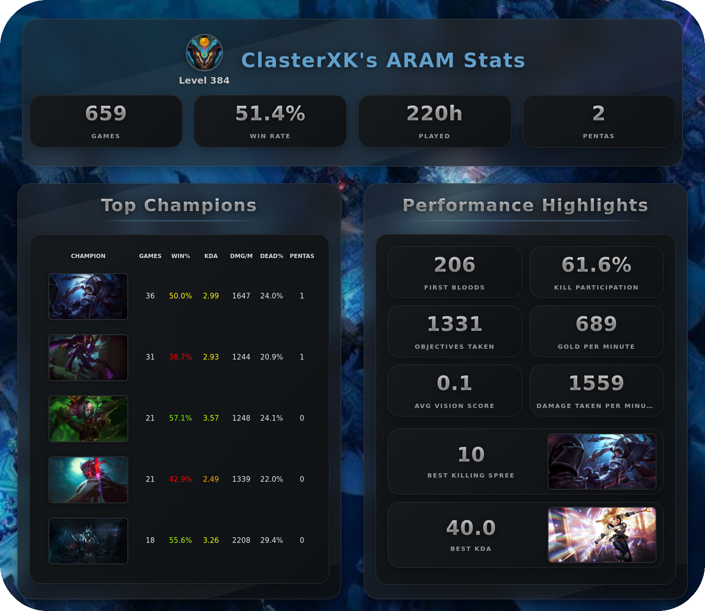
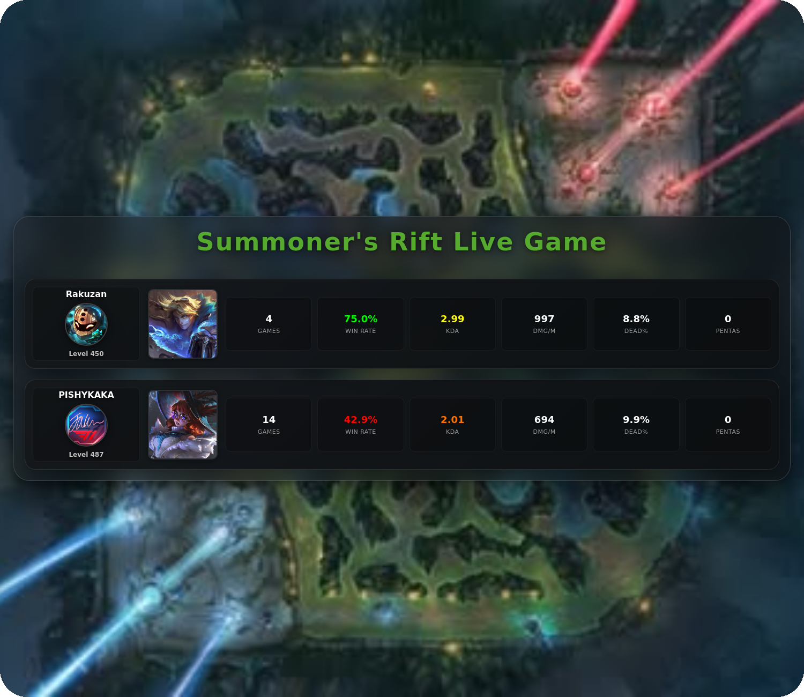

# Discord Advanced LoL Stats Bot

A Discord bot that provides advanced League of Legends statistics and analytics for server members. Track your progress, compare stats, and get detailed insights about your gameplay with beautiful visual cards.

## Features


- Beautiful HTML-based stat cards with customizable sorting



- Real-time player statistics with visual cards



- Detailed match history analysis across different game modes
- Performance tracking and trends by champion
- Player comparisons and friend stats
- Automated stat updates and database maintenance
- Support for multiple game modes (ARAM, Summoner's Rift, Arena, etc.)
- Autocomplete support for player names

## Prerequisites

- Docker and Docker Compose
- Discord Bot Token
- Riot Games API Key

## Installation & Setup

1. Clone the repository:
```bash
git clone https://github.com/GabrielAgrela/Discord_Advanced_LoL_Stats.git
cd Discord_Advanced_LoL_Stats
```

2. Set up environment variables:
   - Create your `.env` file by copying the `.env.example` file
   - Update the following variables:
```env
DISCORD_TOKEN=your_discord_bot_token
RIOT_API_KEY=your_riot_api_key
```

## Running the Bot

### Production Mode
```bash
docker-compose up -d
```

To stop the bot:
```bash
docker-compose stop
```

### Development/Debug Mode

To enable debugging:

1. In the Dockerfile, uncomment the debugging section:
```dockerfile
# Debugging
# RUN pip install debugpy
# ENTRYPOINT ["python", "-m", "debugpy", "--listen", "0.0.0.0:5678", "--wait-for-client", "src/bot.py"]
```

2. Rebuild and run the container:
```bash
docker-compose build
docker-compose up
```

3. The container will wait for a debugger connection on port 5678 before starting the bot
4. Connect your IDE's debugger to localhost:5678
In VSCode your launch.json should be something like this:
```json
{
    "version": "0.2.0",
    "configurations": [
    
        {
            "name": "Python: Remote Attach",
            "type": "python",
            "request": "attach",
            "connect": {
                "host": "localhost",
                "port": 5678
            },
            "pathMappings": [
                {
                    "localRoot": "${workspaceFolder}",
                    "remoteRoot": "/app"
                }
            ],
            "justMyCode": true
        }
    ]
}
```
5. Set breakpoints in your code and debug as needed

## Commands

- `/get_player_stats [summoner_name] [gamemode] [champion] [sort_by] [sort_order]` - Display detailed stats for a summoner
  - Supports various game modes: ARAM, Summoner's Rift, Arena, Nexus Blitz, Swarm, Ultimate Book, URF
  - Sort options: champion_games, winrate, kda, dpm, time_dead, pentas
- `/get_all_players_stats` - Show stats for all tracked players
- `/compare_players [username1] [username2] [gamemode] [champion]` - Compare two players' stats
- `/player_friends_stats [username]` - View stats when playing with friends
- `/update_database` - Update the database with new matches
- `/add_player_to_database [username] [tagline]` - Add a new player to track
- `/generate_card [summoner_name] [gamemode] [sort_by] [sort_order] [min_games]` - Generate a beautiful visual stat card

## Project Structure

```
Discord_Advanced_LoL_Stats/
├── src/
│   ├── assets/
│   │   ├── gamedata/
│   │   └── templates/
│   ├── cogs/
│   │   ├── CardGenerator.py
│   │   ├── Commands.py
│   │   ├── DatabaseOperations.py
│   │   ├── DataFormatter.py
│   │   ├── Loops.py
│   │   └── RiotAPIOperations.py
│   ├── database/
│   ├── models/
│   ├── bot.py
│   └── Utils.py
├── docker-compose.yml
├── Dockerfile
└── requirements.txt
```

## Contributing

1. Fork the repository
2. Create a feature branch
3. Commit your changes
4. Push to the branch
5. Open a Pull Request

## License

This project is licensed under the MIT License - see the LICENSE file for details.

## Acknowledgments

- Riot Games API
- disnake library
- All contributors and users of the bot 